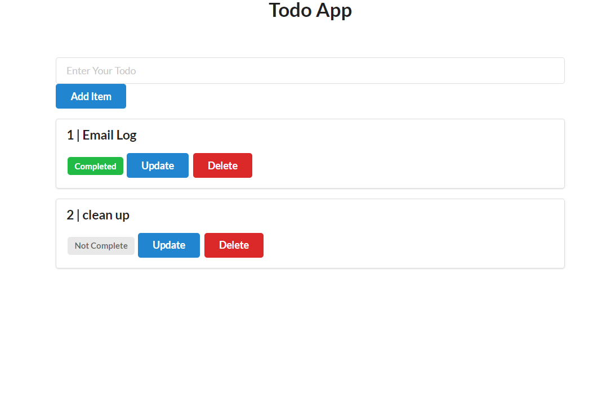

# Basic To-Do App

A simple To-Do app powered by Flask and performs CRUD operations using SQLAlchemy.

For styling [semantic-ui](https://semantic-ui.com/) is used.



## Dependencies

You will need to install [Flask](https://flask.palletsprojects.com/en/1.1.x/installation/#installation) following the installation instructions in the documentation.

### Setup
Create project with virtual environment

```console
$ mkdir myproject
$ cd myproject
$ python3 -m venv venv
```

Activate it (I used Windows)
```console
venv\Scripts\activate
```

Install Flask and SQLAlchemy
```console
$ pip install Flask
$ pip install Flask-SQLAlchemy
```

Set environment variables in terminal (Windows)
```console
$ set FLASK_APP=app.py
$ set FLASK_ENV=development
```

Run the app
```console
$ flask run
```

## Deployment
The To-Do app is deployed at [https://hello-flaskr.herokuapp.com/](https://hello-flaskr.herokuapp.com/). I used Heroku CLI to deploy my app. I used this [article](https://medium.com/@gitaumoses4/deploying-a-flask-application-on-heroku-e509e5c76524) from Medium to teach myself the process. 

It is a fairly simple process; some hiccups I ran into were making sure the Procfile had the correct contents and including all my packages in the requirements.txt.


